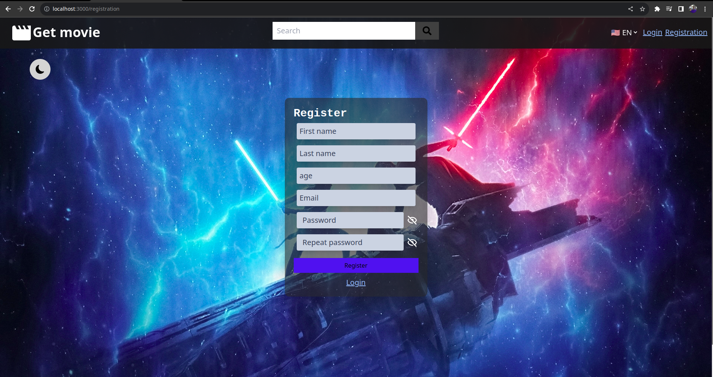
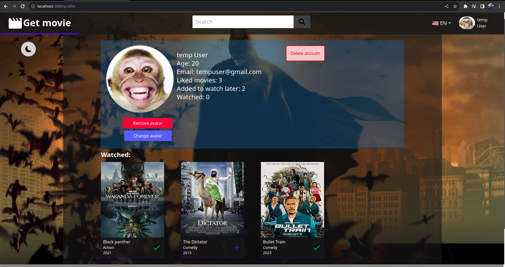
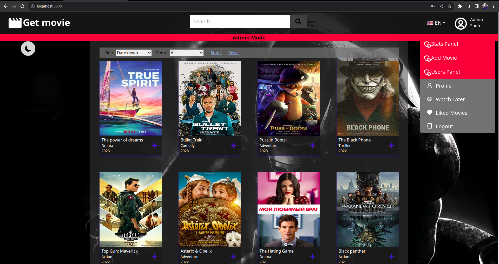
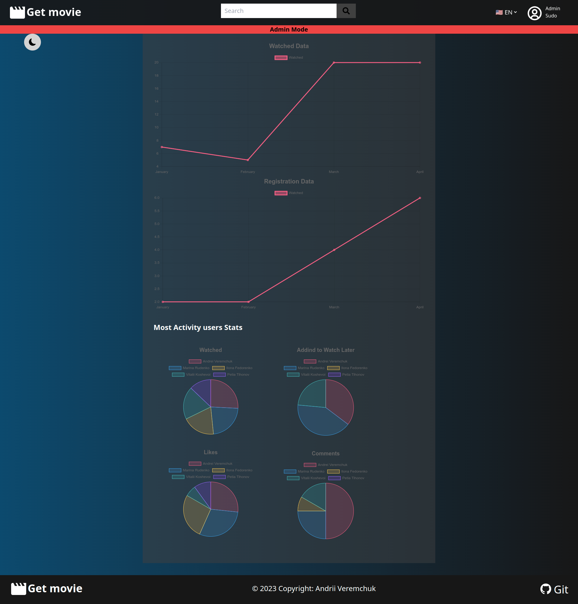

# Movie-app

Simple site for watching movies, which provides for the registration of users, as well as the purchase of a premium subscription.

### Movies
Movies can be sorted, filtered.
Also, each film can be commented on, added to the list of favorites, or just like.

### Users
Users can be the following,
unregistered user: 
 - viewing public content

registered user:
 - like movies, 
 - write comments, 
 - add to favorites list, 
 - see views

premium user:
 - watching premium content

Administrator:
 - deleting movies,
 - changing movies, 
 - take user premium
 - delete user account

## Pages screenshots

<p align="center">
  
  <br>
  <em>Home page</em>
</p>

<p align="center">
  
  <br>
  <em>Movie watch page</em>
</p>

<p align="center">
  
  <br>
  <em>Registration page</em>
</p>

<p align="center">
  
  <br>
  <em>Profile page</em>
</p>

<p align="center">
  
  <br>
  <em>Admin mode</em>
</p>
<p align="center">
  
  <br>
  <em>Admin stats page</em>
</p>

## Dependencies

### Client
 - [Next.js](https://nextjs.org/)
 - [tailwintcss](https://tailwindcss.com/)
 - [react-hook-form](https://react-hook-form.com/)
 - [tanstack/react-query](https://tanstack.com/query/latest)
 - [react-chartjs-2](https://react-chartjs-2.js.org/)
 - [react-icons](https://react-icons.github.io/react-icons/)
### Server
 - [exress.js](https://expressjs.com/)
 - [prisma.io](https://www.prisma.io/)
 - [bcryptjs](https://openbase.com/js/bcryptjs/documentation)
 - [jsonwebtoken](https://jwt.io/)
### Database
- [PostgeSQL](https://www.postgresql.org/)

## Getting Started
### Database

To start database move to [file](./databaseDocker/docker-compose.yml), in terminal and write:

```
docker-compose up
```
